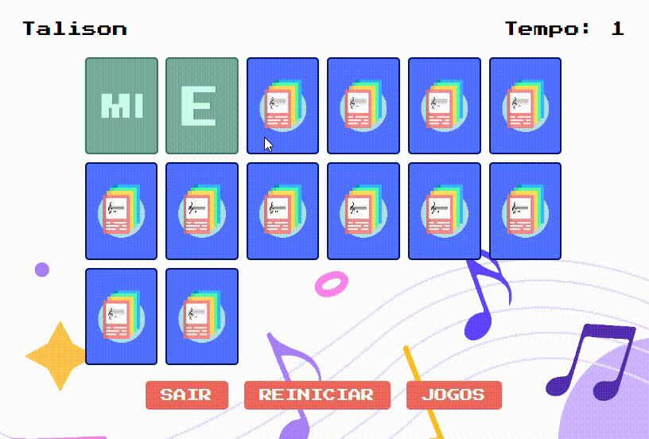

## Memória Musical

Bem-vindo ao projeto Memória Musical! Este projeto é um jogo interativo que combina a diversão dos jogos de memória com o aprendizado musical. Desenvolvido como trabalho final para o curso de Sistemas para Internet no Instituto Federal de Brasília - Campus Brasília, com orientação da professora Kadidja Oliveira.

## Demonstração

Veja abaixo um GIF que demonstra como o projeto funciona:



## Descrição

O Memória Musical é um jogo de memória onde os jogadores devem combinar pares de cartas que representam notas musicais e conceitos musicais. Além do jogo principal, o projeto inclui um sistema de login simples, uma tela de informações e um design responsivo para uma experiência de usuário agradável em diferentes dispositivos.

## Funcionalidades

- **Jogo de Memória Musical:** Encontre e combine pares de cartas com notas e conceitos musicais.
- **Tela de Login:** Interface para autenticação de usuários.
- **Tela de Informações:** Card com detalhes sobre o projeto e os desenvolvedores.
- **Design Responsivo:** Adaptável a diferentes tamanhos de tela para uma melhor experiência de usuário.

## Tecnologias Utilizadas

- **HTML5:** Estrutura do conteúdo da página.
- **CSS3:** Estilização e design responsivo.
- **JavaScript:** Funcionalidades interativas e lógica do jogo.

## Como Usar

Para usar o **Memória Musical**, siga estas etapas:

1. **Clone o Repositório**

   Copie o repositório para sua máquina local com o comando:

   ```bash
   git clone https://github.com/SEU_USUARIO/memoria-musical.git

2. **Navegue até o Diretório do Projeto**
   
    Use o terminal para acessar o diretório do projeto clonado:

    ```bash
    cd memoria-musical

3. **Abra o Arquivo index.html**

    Você pode abrir o arquivo index.html diretamente em seu navegador para iniciar o jogo. Se estiver utilizando um editor de texto ou IDE, abra o arquivo index.html e visualize o projeto localmente:

    ```bash
    open index.html  # No macOS
    start index.html # No Windows
    xdg-open index.html # No Linux
   ```
    Ou, basta arrastar e soltar o arquivo index.html no navegador.

## Estrutura do Projeto

- **index.html:** Página principal do jogo e do formulário de login.
- **css/:** Contém os arquivos de estilo.
- **reset.css:** Reset de estilos padrões do navegador.
- **login.css:** Estilo do formulário de login.
- **style.css:** Estilo principal do jogo e do card de informações.
- **js/:** Contém os scripts JavaScript.
- **login.js:** Funcionalidades do formulário de login.
- **game.js:** Lógica do jogo de memória.
- **images/:** Contém as imagens utilizadas no projeto.

## Contribuição

Se você deseja contribuir para este projeto, por favor siga os seguintes passos:

1. Faça um fork do repositório.
2. Crie uma branch para sua feature ou correção (git checkout -b minha-feature).
3. Faça commit das suas alterações (git commit -am 'Adiciona nova feature').
4. Envie para o remote (git push origin minha-feature).
5. Abra um pull request no GitHub.

## Contato
Para mais informações, você pode entrar em contato com os desenvolvedores:

- **Talison Yago** - talisons35@gmail.com
- **Leonardo** - leonardosantos1752@gmail.com

Muito obrigado!


